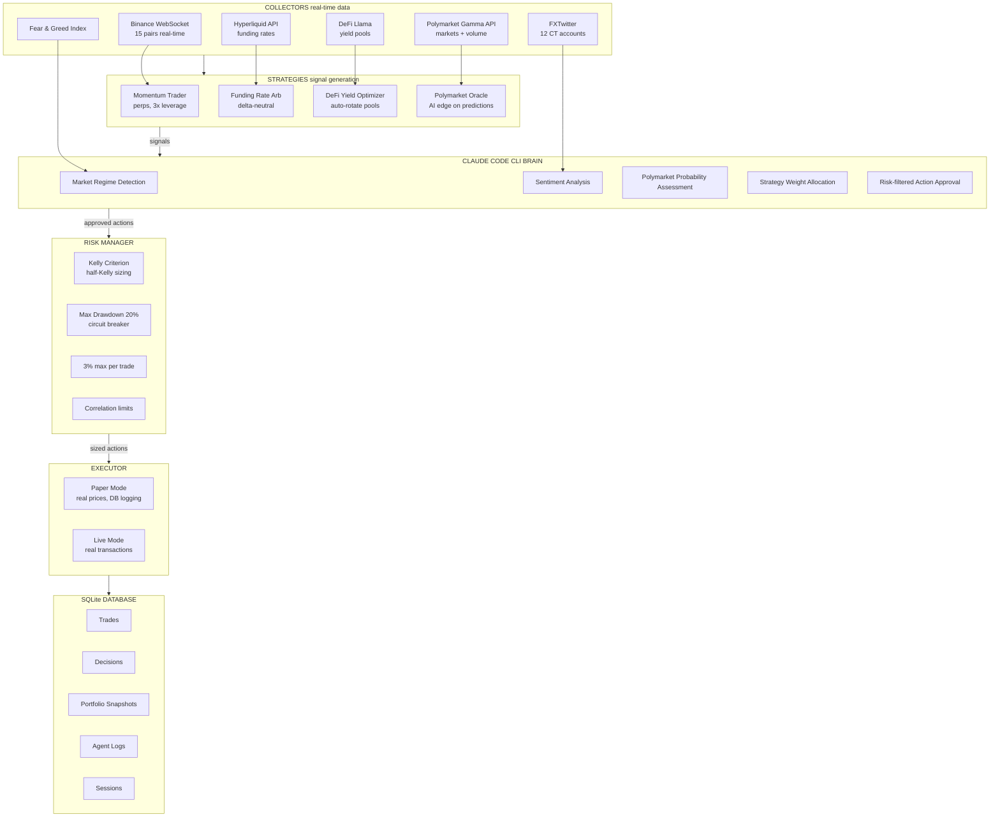
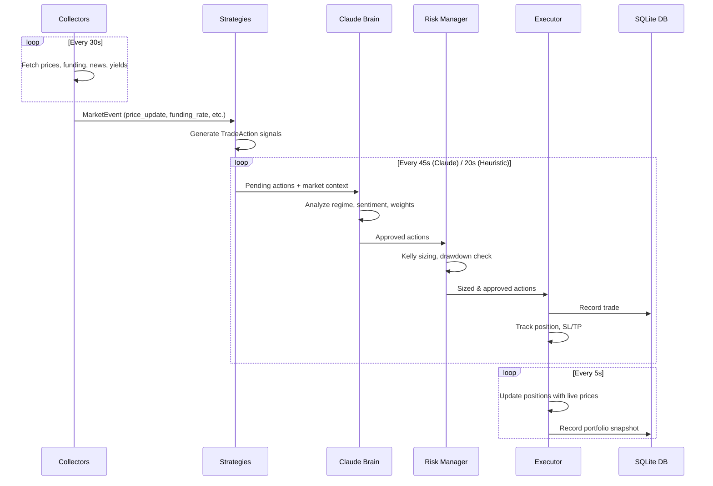
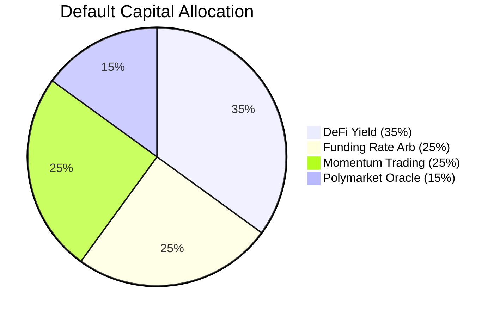

# SurviveAgent

Autonomous Web3 Trading Agent powered by Claude Code CLI. Given USDC, it survives and multiplies across futures, Polymarket, DeFi yield, funding rate arbitrage, and more.

## Architecture



## Data Flow



## Strategy Allocation



## How to Use — Talk to the Agent

SurviveAgent is designed to be operated by talking to Claude. Open this repo with Claude Code and just talk:

```
You: "start paper trading with $1000"
You: "change allocation to 40% yield, 30% funding, 20% momentum, 10% polymarket"
You: "show me the trades"
You: "how are we doing?"
You: "go live with $10"
```

Claude reads `CLAUDE.md` and knows exactly how to operate the system.

## Setup (Copy-Paste)

### Step 1: Install Prerequisites

```bash
# Node.js 18+
node --version

# Install Foundry (for wallet management)
curl -L https://foundry.paradigm.xyz | bash
foundryup

# Install Claude Code CLI (the AI brain)
npm install -g @anthropic-ai/claude-code
```

### Step 2: Clone & Install

```bash
git clone https://github.com/yeheskieltame/SurviveAgent.git
cd SurviveAgent
npm install
mkdir -p data
cp .env.example .env
```

### Step 3: Generate Wallet

```bash
node scripts/agent.mjs wallet --new
```

This generates a wallet using `cast wallet new` and saves it to `data/config.json`.

### Step 4: Start the Server

```bash
# Terminal 1: Start the Next.js server
npm run dev
```

### Step 5: Start Paper Trading

```bash
# Terminal 2: Use the agent CLI
node scripts/agent.mjs start --balance 1000 --mode paper
```

Or just open Claude Code in this repo and say: **"start paper trading"**

### Step 6: Monitor

```bash
# Check status
node scripts/agent.mjs status

# View trades
node scripts/agent.mjs trades

# View stats
node scripts/agent.mjs stats

# Open dashboard
open http://localhost:3000

# Open trade history
open http://localhost:3000/trades
```

### Step 7: Check Database

```bash
# All trades
sqlite3 data/surviveagent.db "SELECT opened_at, strategy, asset, side, amount, pnl, reasoning FROM trades ORDER BY opened_at DESC LIMIT 10;"

# P&L by strategy
sqlite3 data/surviveagent.db "SELECT strategy, COUNT(*) as trades, ROUND(SUM(pnl),4) as pnl FROM trades WHERE status='closed' GROUP BY strategy;"

# Session summary
sqlite3 data/surviveagent.db "SELECT * FROM sessions;"
```

## Agent CLI Reference

```bash
# Status
node scripts/agent.mjs status

# Start/Stop
node scripts/agent.mjs start --balance 1000 --mode paper
node scripts/agent.mjs start --balance 10 --mode live
node scripts/agent.mjs stop

# Trades & Stats
node scripts/agent.mjs trades --limit 50
node scripts/agent.mjs stats

# Configuration
node scripts/agent.mjs config
node scripts/agent.mjs config --set '{"momentum":30,"funding_arb":30,"yield":25,"polymarket":15}'
node scripts/agent.mjs config --mode paper --balance 500
node scripts/agent.mjs config --risk '{"maxDrawdown":15,"maxSingleTradeRisk":2}'

# Wallet
node scripts/agent.mjs wallet
node scripts/agent.mjs wallet --new
```

## Testing Guide (1 Day Paper Test)

### What Happens

- **Real data, simulated trades**: Prices from Binance/CoinGecko live. Trades include realistic slippage (0.05-0.2%) and fees (0.05%).
- **Everything logged**: Every trade, decision, and portfolio snapshot saved to SQLite.
- **No funds at risk**: Paper mode does not touch any wallet.

### What to Watch For

| Metric | Good | Bad |
|--------|------|-----|
| Win Rate | >50% | <40% |
| Total P&L | Positive | Negative trend |
| Max Drawdown | <10% | >20% (circuit breaker fires) |
| Funding Revenue | Steady positive | Should always be positive |
| Yield Accrual | Steady positive | Should always be positive |

### Expected Behavior (24h)

- **Funding Rate Arb**: Small, steady returns (~0.01-0.05% per 8h funding cycle)
- **DeFi Yield**: Yield accrual (~8-15% APY)
- **Momentum**: Trades only on >3% moves with sentiment confirmation
- **Polymarket**: Trades only when Claude finds mispriced markets

## Going Live with $10 USDC

After paper testing looks good:

```bash
# 1. Create wallet (if not done)
node scripts/agent.mjs wallet --new

# 2. Send 10 USDC to wallet address on Arbitrum
#    (use any exchange or bridge)

# 3. Send ~$0.10 ETH for gas on Arbitrum

# 4. Verify balance
node scripts/agent.mjs wallet

# 5. Configure and go live
node scripts/agent.mjs config --mode live --balance 10
node scripts/agent.mjs start

# 6. Monitor
node scripts/agent.mjs status
```

Or just tell Claude: **"go live with $10 on arbitrum"**

## Database Schema

```
sessions          — Track each run (start/stop times, P&L)
trades            — Every trade with entry/exit/P&L/reasoning
decisions         — Claude Brain decisions (regime, sentiment, weights)
portfolio_snapshots — Equity curve over time
agent_logs        — All terminal output
```

## API Endpoints

| Endpoint | Method | Description |
|----------|--------|-------------|
| `/api/agent/start` | POST | Start the agent engine |
| `/api/agent/stop` | POST | Stop the agent engine |
| `/api/agent/status` | GET | Current engine state |
| `/api/stream` | GET | SSE stream for real-time updates |
| `/api/trades` | GET | All paper trades from DB |
| `/api/stats` | GET | Overall statistics and sessions |

## Tech Stack

| Layer | Technology |
|-------|------------|
| Framework | Next.js 14 (App Router) |
| Language | TypeScript |
| UI | Tailwind CSS v4, Recharts |
| AI Brain | Claude Code CLI (`claude --print`) |
| Database | SQLite (better-sqlite3) |
| Prices | Binance WebSocket + CoinGecko |
| Funding | Binance Futures + Hyperliquid API |
| News | FXTwitter + Fear & Greed Index |
| Yields | DeFi Llama |
| Predictions | Polymarket Gamma API |
| Risk | Kelly Criterion, Half-Kelly |
| SDKs | @nktkas/hyperliquid, @jup-ag/api, @polymarket/clob-client, pumpdotfun-sdk |

## Project Structure

```
src/
├── app/
│   ├── api/
│   │   ├── agent/start/     # Start engine
│   │   ├── agent/stop/      # Stop engine
│   │   ├── agent/status/    # Engine state
│   │   ├── stream/          # SSE real-time stream
│   │   ├── trades/          # Trade history from DB
│   │   └── stats/           # Statistics from DB
│   ├── trades/              # Trade history page
│   ├── layout.tsx
│   └── page.tsx             # Main dashboard
├── components/
│   ├── Header.tsx
│   ├── PnLChart.tsx
│   ├── Terminal.tsx
│   ├── SubAgentCards.tsx
│   ├── ActiveTrades.tsx
│   ├── CoordinatorStatus.tsx
│   ├── MarketDataPanel.tsx
│   └── StrategyBreakdown.tsx
├── lib/
│   ├── brain/
│   │   ├── claude-brain.ts  # Claude Code CLI integration
│   │   └── types.ts
│   ├── collectors/
│   │   ├── base.ts          # Collector interface
│   │   ├── price-collector.ts
│   │   ├── funding-collector.ts
│   │   ├── news-collector.ts
│   │   ├── yield-collector.ts
│   │   └── polymarket-collector.ts
│   ├── strategies/
│   │   ├── base.ts          # Strategy interface
│   │   ├── momentum.ts
│   │   ├── funding-arb.ts
│   │   ├── yield-optimizer.ts
│   │   └── polymarket-trader.ts
│   ├── executors/
│   │   ├── base.ts          # Executor interface
│   │   └── paper-executor.ts
│   ├── risk/
│   │   └── manager.ts       # Kelly Criterion + risk limits
│   ├── db/
│   │   ├── database.ts      # SQLite schema + queries
│   │   └── recorder.ts      # Engine-to-DB bridge
│   ├── server/
│   │   └── engine.ts        # Main Collector→Strategy→Executor pipeline
│   ├── agent-engine.ts      # State management + client engine
│   ├── agent-context.tsx     # React context
│   └── utils.ts
├── types/
│   └── agent.ts
data/
└── surviveagent.db          # SQLite database (created on first run)
```

## License

MIT
