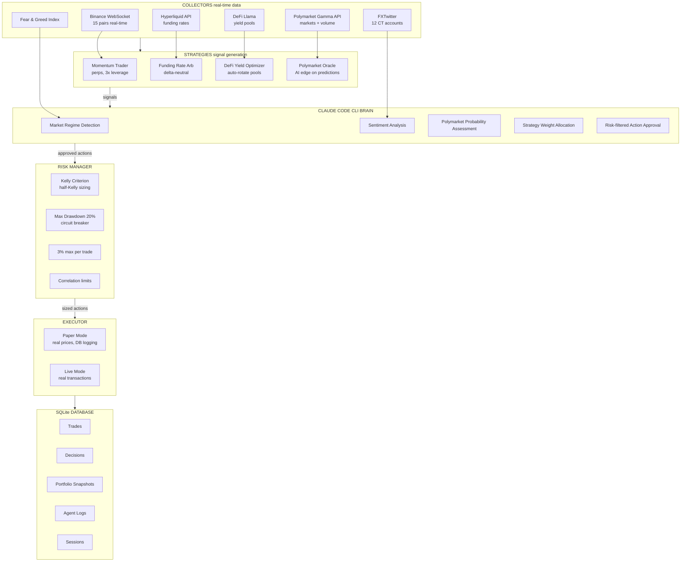
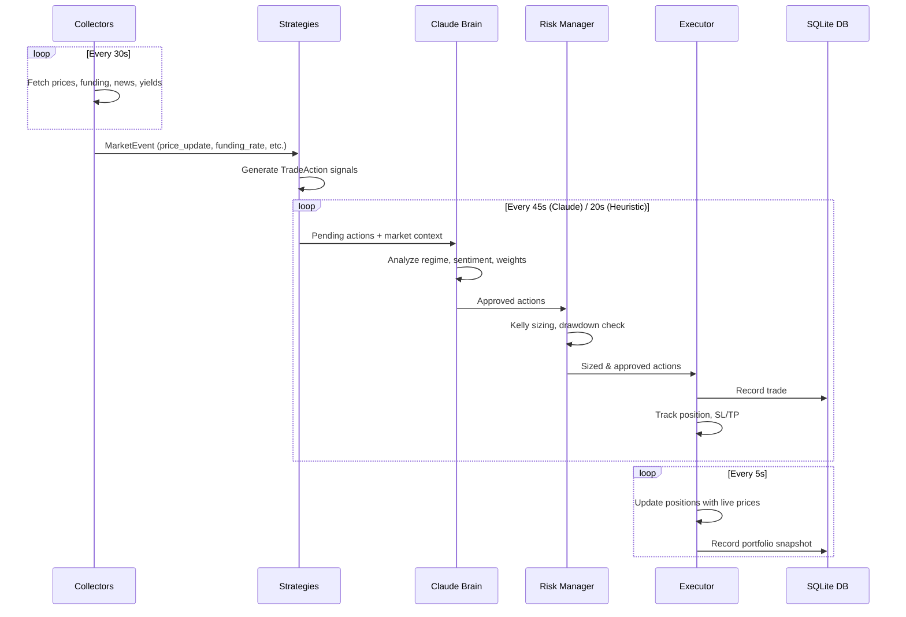
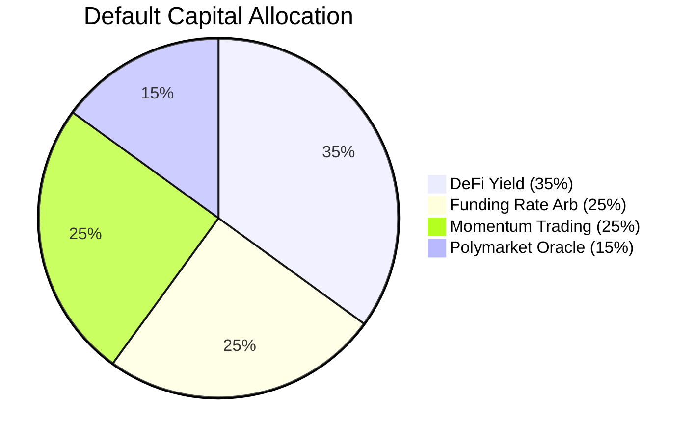

# SurviveAgent

Autonomous Web3 Trading Agent powered by Claude Code CLI. Given USDC, it survives and multiplies across futures, Polymarket, DeFi yield, funding rate arbitrage, and more.

## Architecture



## Data Flow



## Strategy Allocation



## Quick Start

### Prerequisites

```bash
# Node.js 18+ required
node --version  # v18.x or higher

# Install Foundry (for wallet setup with cast)
curl -L https://foundry.paradigm.xyz | bash
foundryup

# Install Claude Code CLI (the AI brain)
npm install -g @anthropic-ai/claude-code
```

### 1. Clone & Install

```bash
git clone https://github.com/yeheskieltame/SurviveAgent.git
cd SurviveAgent
npm install
```

### 2. Create a Test Wallet (using cast)

```bash
# Generate a new wallet
cast wallet new

# Output will look like:
# Successfully created new keypair.
# Address:     0xYOUR_ADDRESS_HERE
# Private key: 0xYOUR_PRIVATE_KEY_HERE

# SAVE BOTH! The private key is needed for live trading later.
# For testing mode, you don't need any funds in this wallet.
```

### 3. Create Environment File

```bash
cp .env.example .env
```

Edit `.env`:

```bash
# Wallet (for future live trading)
WALLET_ADDRESS=0xYOUR_ADDRESS_HERE
WALLET_PRIVATE_KEY=0xYOUR_PRIVATE_KEY_HERE

# Optional: RPC endpoints (defaults work fine for testing)
# ETHEREUM_RPC=https://eth.llamarpc.com
# ARBITRUM_RPC=https://arb1.arbitrum.io/rpc
# SOLANA_RPC=https://api.mainnet-beta.solana.com
```

### 4. Create Data Directory

```bash
mkdir -p data
```

### 5. Start Paper Trading (Testing Mode)

```bash
npm run dev
```

Open [http://localhost:3000](http://localhost:3000) in your browser.

1. Click **"Deploy Agent"** button
2. Watch the terminal — it shows real-time data fetching and decisions
3. All trades are paper trades with **real market prices**
4. Every trade is logged to `data/surviveagent.db`

### 6. View Trade History

Open [http://localhost:3000/trades](http://localhost:3000/trades) to see:

- All paper trades with entry/exit prices
- P&L per trade
- Win rate and statistics
- Session history

### 7. Check Database Directly (Optional)

```bash
# Install sqlite3 CLI if needed
# apt install sqlite3  (Linux)
# brew install sqlite3  (Mac)

# Open the database
sqlite3 data/surviveagent.db

# View all trades
SELECT * FROM trades ORDER BY opened_at DESC LIMIT 20;

# View session summary
SELECT * FROM sessions;

# View overall stats
SELECT
  COUNT(*) as total_trades,
  SUM(CASE WHEN pnl > 0 THEN 1 ELSE 0 END) as wins,
  SUM(CASE WHEN pnl <= 0 THEN 1 ELSE 0 END) as losses,
  ROUND(SUM(pnl), 4) as total_pnl,
  ROUND(AVG(pnl), 4) as avg_pnl
FROM trades WHERE status = 'closed';

# View decisions made by Claude
SELECT cycle_number, regime, sentiment, analysis
FROM decisions ORDER BY created_at DESC LIMIT 10;

# Exit
.quit
```

## Testing Guide (1 Day Test)

### What Happens in Paper Mode

1. **Real data, fake trades**: Prices come from Binance/CoinGecko live. Trades are simulated with real prices including slippage (0.05-0.2%) and fees (0.05%).

2. **Everything is logged**: Every trade, every decision, every portfolio snapshot goes to SQLite.

3. **No funds at risk**: Paper mode uses no real wallet. It simulates positions and tracks what would have happened.

### What to Watch For

| Metric | Good Sign | Bad Sign |
|--------|-----------|----------|
| Win Rate | >50% | <40% |
| Avg P&L/Trade | Positive | Consistently negative |
| Max Drawdown | <10% | >20% (circuit breaker fires) |
| Sharpe Ratio | >1.0 | <0 |
| Funding Revenue | Steady positive | N/A (should always be positive) |
| Yield Accrual | Steady positive | N/A (should always be positive) |

### Expected Behavior (24h)

- **Funding Rate Arb**: Should generate small, steady positive returns (~0.01-0.05% per 8h funding cycle)
- **DeFi Yield**: Should show yield accrual (~8-15% APY, so ~$0.002/day on $10)
- **Momentum**: May or may not trade (only trades on >3% moves with sentiment alignment)
- **Polymarket**: May or may not trade (only when Claude finds mispriced markets)

## Going Live with $10 USDC

After 1 day of paper testing, if results look good:

### 1. Fund Your Wallet

```bash
# Check your wallet address
echo $WALLET_ADDRESS

# Send 10 USDC to your wallet on Arbitrum (cheapest gas)
# Use any exchange or bridge to send USDC to the address
```

### 2. Verify Balance

```bash
# Check USDC balance on Arbitrum
cast call \
  0xaf88d065e77c8cC2239327C5EDb3A432268e5831 \
  "balanceOf(address)(uint256)" \
  $WALLET_ADDRESS \
  --rpc-url https://arb1.arbitrum.io/rpc

# Should show: 10000000 (10 USDC with 6 decimals)
```

### 3. Check ETH for Gas

```bash
# You need a tiny bit of ETH for gas on Arbitrum (~$0.10 worth)
cast balance $WALLET_ADDRESS --rpc-url https://arb1.arbitrum.io/rpc
```

### 4. Switch to Live Mode

> **WARNING**: Live mode executes real transactions. Start with $10. Never risk more than you can afford to lose.

```bash
# In .env, add:
TRADING_MODE=live

# Restart
npm run dev
```

## Database Schema

```
sessions          — Track each run (start/stop times, P&L)
trades            — Every trade with entry/exit/P&L/reasoning
decisions         — Claude Brain decisions (regime, sentiment, weights)
portfolio_snapshots — Equity curve over time
agent_logs        — All terminal output
```

## API Endpoints

| Endpoint | Method | Description |
|----------|--------|-------------|
| `/api/agent/start` | POST | Start the agent engine |
| `/api/agent/stop` | POST | Stop the agent engine |
| `/api/agent/status` | GET | Current engine state |
| `/api/stream` | GET | SSE stream for real-time updates |
| `/api/trades` | GET | All paper trades from DB |
| `/api/stats` | GET | Overall statistics and sessions |

## Tech Stack

| Layer | Technology |
|-------|------------|
| Framework | Next.js 14 (App Router) |
| Language | TypeScript |
| UI | Tailwind CSS v4, Recharts |
| AI Brain | Claude Code CLI (`claude --print`) |
| Database | SQLite (better-sqlite3) |
| Prices | Binance WebSocket + CoinGecko |
| Funding | Binance Futures + Hyperliquid API |
| News | FXTwitter + Fear & Greed Index |
| Yields | DeFi Llama |
| Predictions | Polymarket Gamma API |
| Risk | Kelly Criterion, Half-Kelly |
| SDKs | @nktkas/hyperliquid, @jup-ag/api, @polymarket/clob-client, pumpdotfun-sdk |

## Project Structure

```
src/
├── app/
│   ├── api/
│   │   ├── agent/start/     # Start engine
│   │   ├── agent/stop/      # Stop engine
│   │   ├── agent/status/    # Engine state
│   │   ├── stream/          # SSE real-time stream
│   │   ├── trades/          # Trade history from DB
│   │   └── stats/           # Statistics from DB
│   ├── trades/              # Trade history page
│   ├── layout.tsx
│   └── page.tsx             # Main dashboard
├── components/
│   ├── Header.tsx
│   ├── PnLChart.tsx
│   ├── Terminal.tsx
│   ├── SubAgentCards.tsx
│   ├── ActiveTrades.tsx
│   ├── CoordinatorStatus.tsx
│   ├── MarketDataPanel.tsx
│   └── StrategyBreakdown.tsx
├── lib/
│   ├── brain/
│   │   ├── claude-brain.ts  # Claude Code CLI integration
│   │   └── types.ts
│   ├── collectors/
│   │   ├── base.ts          # Collector interface
│   │   ├── price-collector.ts
│   │   ├── funding-collector.ts
│   │   ├── news-collector.ts
│   │   ├── yield-collector.ts
│   │   └── polymarket-collector.ts
│   ├── strategies/
│   │   ├── base.ts          # Strategy interface
│   │   ├── momentum.ts
│   │   ├── funding-arb.ts
│   │   ├── yield-optimizer.ts
│   │   └── polymarket-trader.ts
│   ├── executors/
│   │   ├── base.ts          # Executor interface
│   │   └── paper-executor.ts
│   ├── risk/
│   │   └── manager.ts       # Kelly Criterion + risk limits
│   ├── db/
│   │   ├── database.ts      # SQLite schema + queries
│   │   └── recorder.ts      # Engine-to-DB bridge
│   ├── server/
│   │   └── engine.ts        # Main Collector→Strategy→Executor pipeline
│   ├── agent-engine.ts      # State management + client engine
│   ├── agent-context.tsx     # React context
│   └── utils.ts
├── types/
│   └── agent.ts
data/
└── surviveagent.db          # SQLite database (created on first run)
```

## License

MIT
